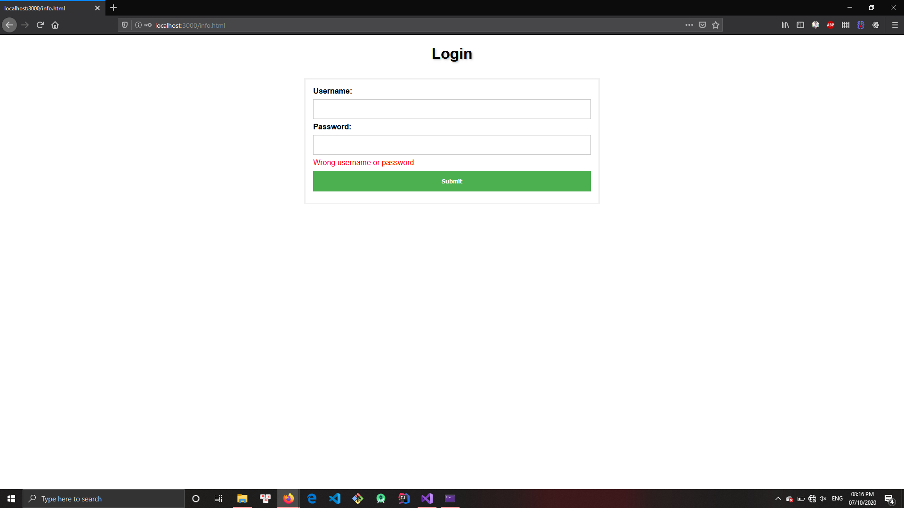
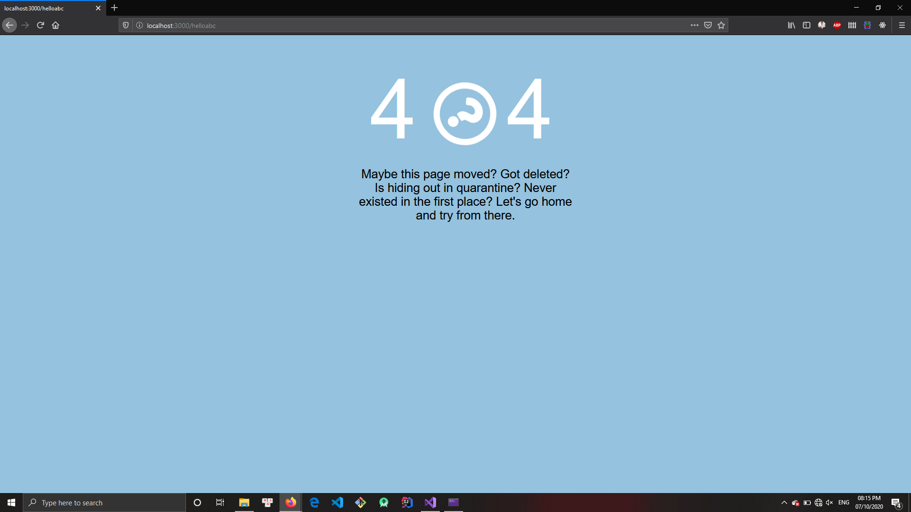

# **BÁO CÁO**

Báo cáo đồ án Socket, bộ môn Mạng máy tính  

<p align="center">

</p>

## Thành viên

Nguyễn Gia Thụy - 1712809  
Lý Quốc Bình - 1712292

## Nội dung

+ Chi tiết mã nguồn
+ Demo chương trình

# Chi tiết mã nguồn

Hàm main của chương trình:

``` c
void main() {
	try {
		Server server("3000");
		std::thread th(&Server::run, &server);
		th.join();
	}
	catch (std::runtime_error& e) {
		std::cout << "Run-time error: " << e.what();
	}
}
```
Prototype của lớp Server:
``` c
class Server
{
public:
    Server(const std::string& port = DEFAULT_PORT); //Constructor

    void run(); //Operate server
   
    ~Server(); //Destructor

private:
    /*---------- Socket-based methods ----------*/

    void initializeWinSock(); //Initialize Windows Socket API

    void createSocket(addrinfo*& result, SOCKET& listenSocket, const char* port); 

    void bindSocket(addrinfo* result, const SOCKET& listenSocket);

    void listenOnSocket(const SOCKET& listenSocket);
    
    SOCKET acceptRequests(); //Process every request from a client (can handle many clients at a time)

    void handleRequests(SOCKET& clientSocket, const std::string* pages);

    /*---------- Utility methods ----------*/

    void handleGET(const std::string& request, const std::string* pages, std::string& response);

    void handlePOST(const std::string& request, const std::string* pages, std::string& response);

    std::string getResponse(std::string& content, int statusCode, const std::string& message); //Required for handleGET and handlePOST methods create every suitable response respected to every request

    bool authentified(const std::string& username, const std::string& password); //Required for handlePOST method, checking for valid usernames and emails

    void cleanUp(); //Clean up resources

private:
    char _port[5];
    std::string _pages[4];
    addrinfo* _result;
    SOCKET _listenSocket;
    std::mutex secureResouce;
};
```

Lớp FileReader - Hỗ trợ đọc files:
``` c
class FileReader {
public:
	static void readContent(const char* path, std::string& content) {
		std::ifstream reader(path);
		if (reader.is_open()) {
			std::string buffer((std::istreambuf_iterator<char>(reader)),
				(std::istreambuf_iterator<char>()));
			reader.close();
			content = buffer;
		}
		else {
			std::cerr << "Cannot read file\n";
		}
	}
};
```

__Chi tiết xem trong [mã nguồn](source/Server.h)__

# Demo chương trình

Sau khi chạy chương trình, ta mở trình duyệt và gõ vào `localhost:[port]` (port tự chọn trong hàm main), trình duyệt sẽ mở file __index.html__ (đường dẫn: _localhost:\[port\]/index.html_) như sau:


Nhập `username` và `password` được quy định trong file __userinfo.dat__. Nếu nhập đúng trình duyệt sẽ mở file __info.html__ (_đường dẫn: localhost:\[port\]/info.html_) như hình:


Nếu nhập sai, trình duyệt sẽ mở file __index_error.html__ (_đường dẫn: localhost:\[port\]/index_error.html_) như hình:



Nếu người dùng gõ vào địa chỉ không tồn tại (ví dụ _localhost:[port]/helloabc_) thì trình duyệt sẽ mở file __error.html__ (_đường dẫn: localhost:\[port\]/error.html_) như hình:



# Lưu ý

- Trình duyệt:  
  - Không hỗ trợ các trình duyệt có lõi Chromium
  - Chạy ổn định nhất trên trình duyệt Microsoft Edge Legacy
- Chức năng:  
  - Chưa có chức năng cấp quyền cho nhiều người dùng (Hiện tại chỉ 1 người dùng)
  - Chưa xử lý được Javascript
